# Life with AI

Conway's Game of Life in Flutter, with a shader-driven neon glow that heats up where cells
congregate, and an AI assistant that designs a starting pattern to produce the outcome you describe.

**Live: https://shanepkearney.github.io/life-with-ai/** (bring your own Anthropic API key for
the assistant; the simulation works without one).

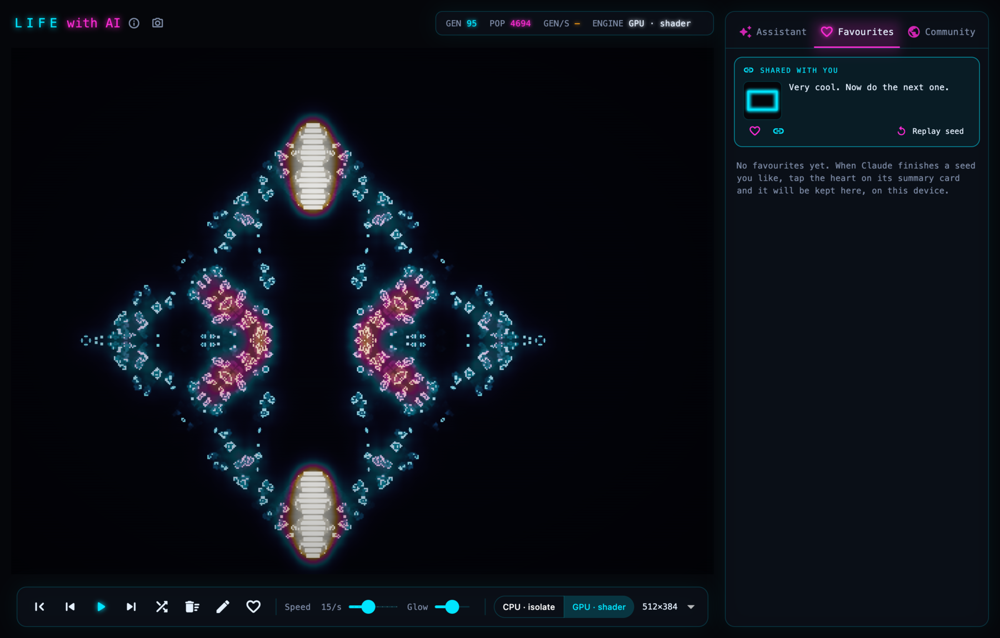

*[Neon Frame](#seeds-made-with-ai) at generation 60, opened from its share link.*

A reimagining of [shanepkearney/life](https://github.com/shanepkearney/life), a Java/Swing
implementation. It keeps the original's rules and toroidal (wrap-around) board, and its
1024×768 board is one of the size presets.

## Seeds made with AI

Four seeds designed with the assistant. Each link opens the seed in the browser and plays it,
with nothing to install. Where the prompt is quoted, it is the one the seed was made from. They are
also the first entries on the app's [Community tab](#community-seeds).

### Oscillator Garden · [▶ play it][oscillator-garden]

> "A symmetric bloom that slowly settles into a garden of oscillators"

Four R-pentominoes in 4-fold rotational symmetry. They erupt, swirl into a pinwheel, and
leave a wide garden of blinkers and still lifes behind.

| Generation 150 | Generation 300 | Generation 1200 |
|---|---|---|
| 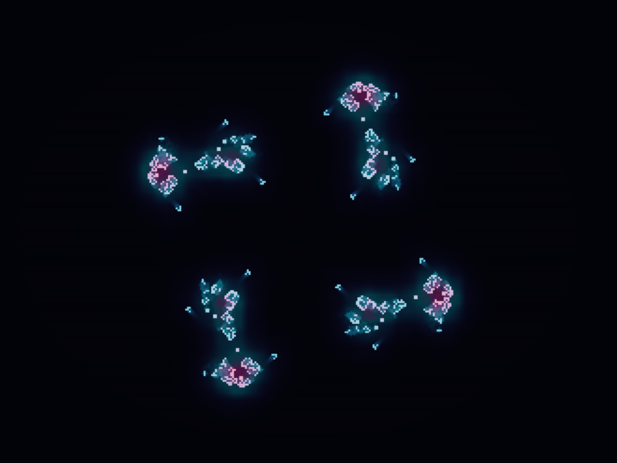 | 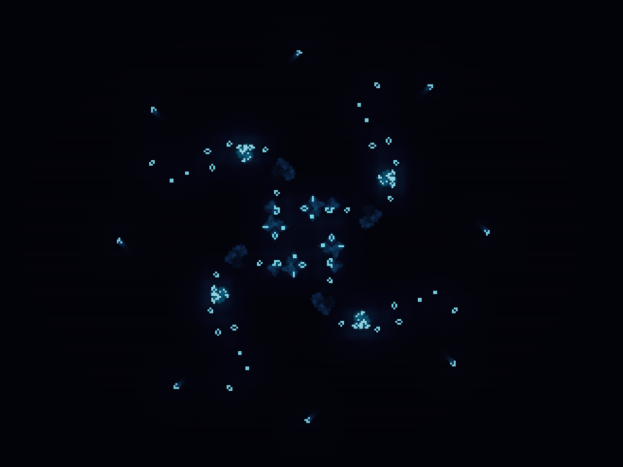 | 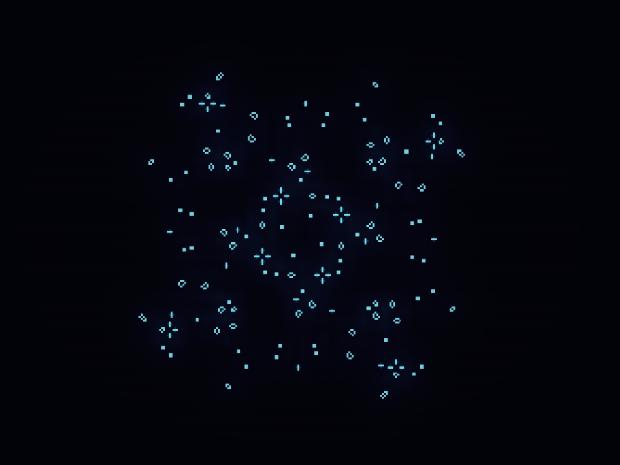 |

### Boxed Chaos · [▶ play it][boxed-chaos]

A rectangle like Neon Frame's (below), packed with random soup. The soup burns white-hot and eats through the walls,
which break into an octagon, and the churn spreads into a diamond before it thins out. It is
also the longest link here, at about 14 KB, which works because a share link's seed travels in
the URL fragment and never reaches the server.

| Generation 0 | Generation 60 | Generation 300 |
|---|---|---|
| 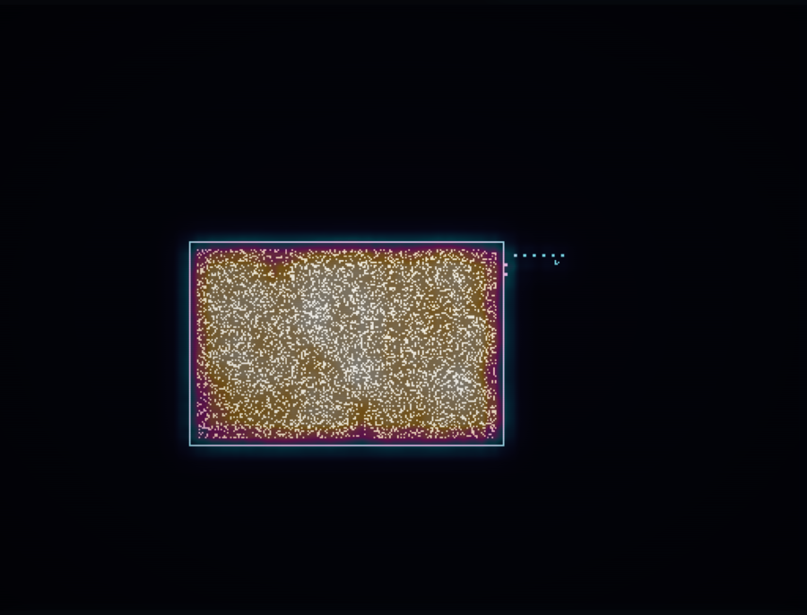 | 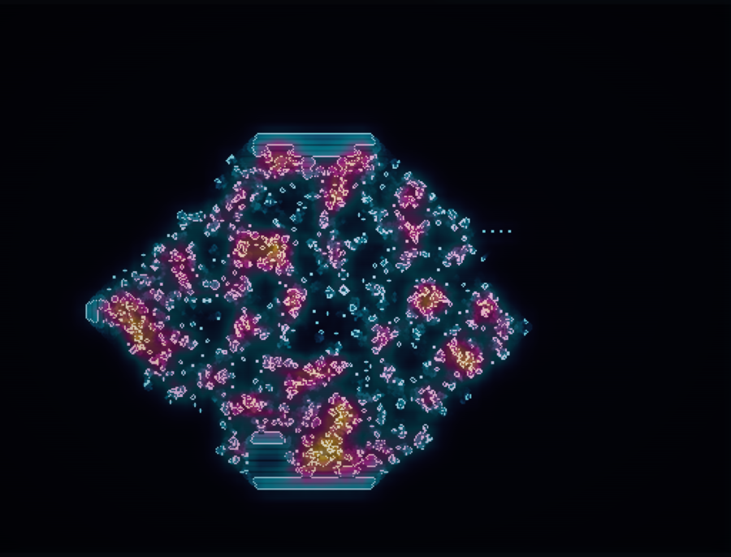 | 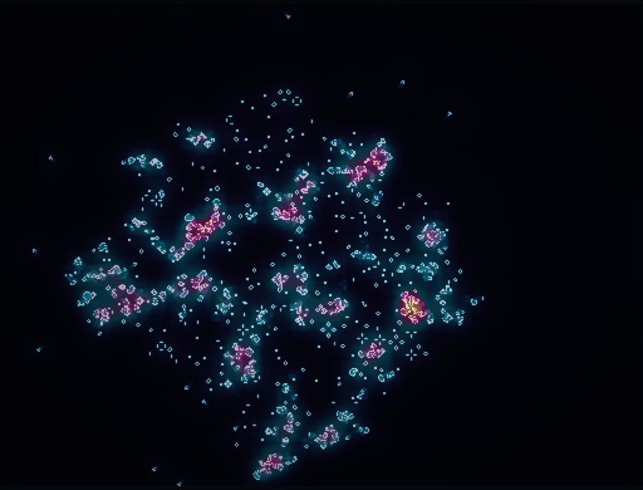 |

### Tool Concert · [▶ play it][tool-concert]

> "A symmetrical bloom you would see at a tool concert."

Nine small patterns on a 3×3 grid, arranged symmetrically around a flower at the center. Each
one blooms into a ring, and by generation 600 the whole stage has settled into a fixed
constellation.

| Generation 20 | Generation 150 | Generation 600 |
|---|---|---|
| 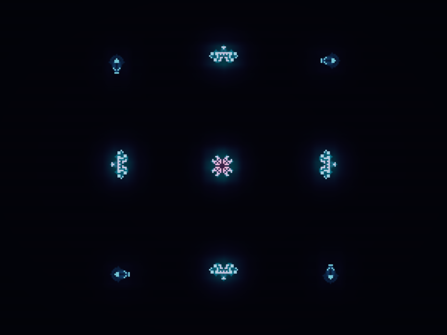 | 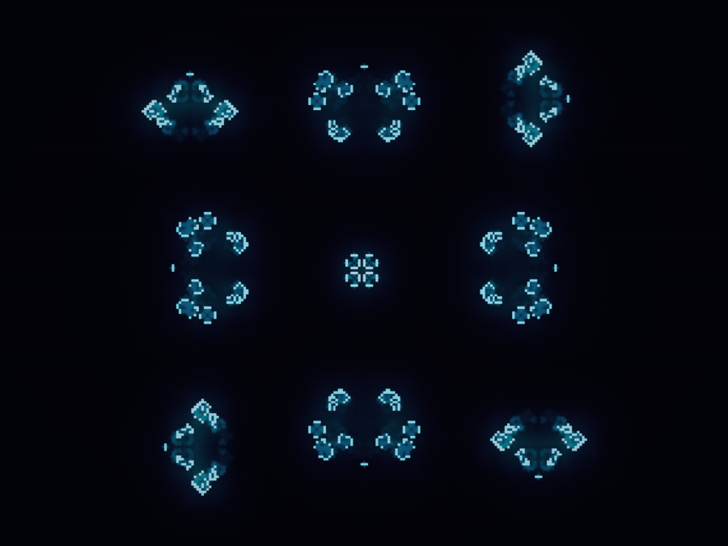 | 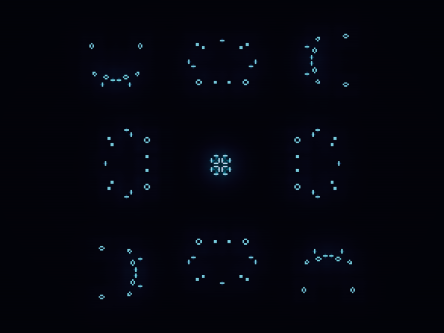 |

### Neon Frame · [▶ play it][neon-frame]

A single hollow rectangle. Within 60 generations its edges fold into a stack of glowing bars,
with four magenta hotspots at the corners. By generation 300 it has opened into a mirrored
diamond of sparks that throws gliders from its tips.

| Generation 0 | Generation 60 | Generation 300 |
|---|---|---|
|  | 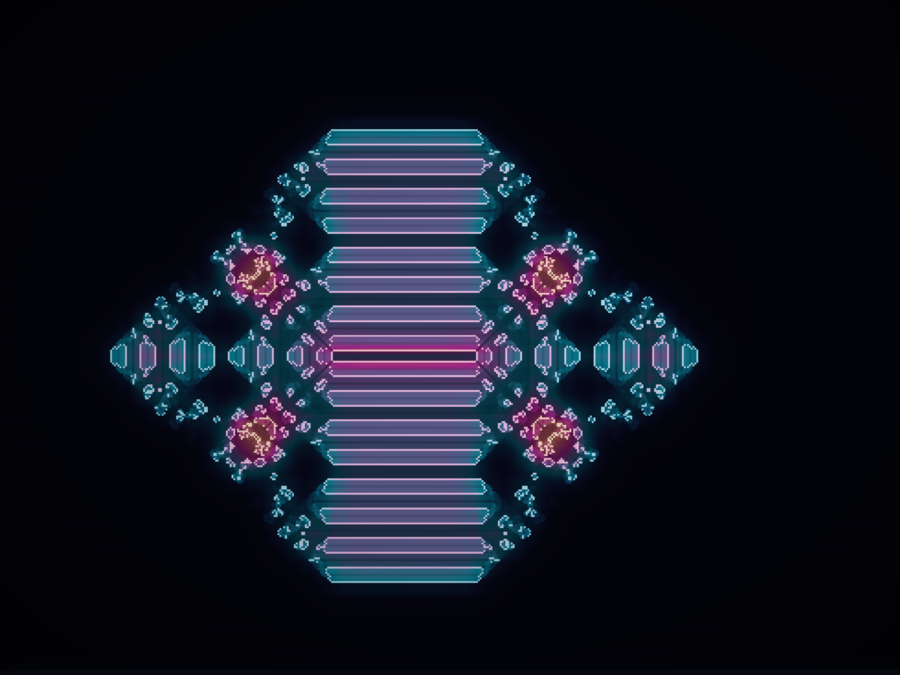 | 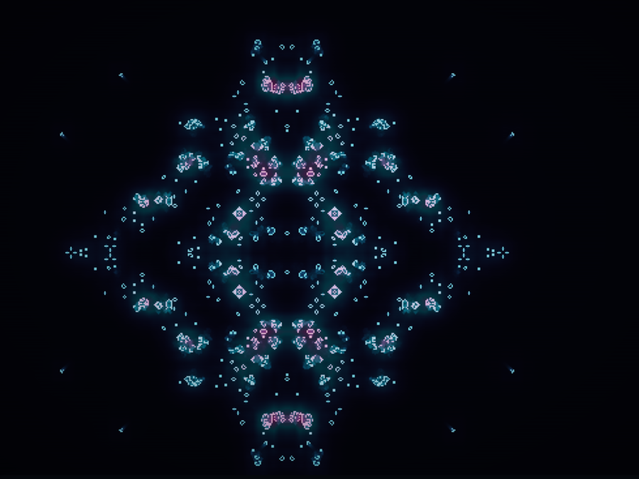 |

[neon-frame]: https://shanepkearney.github.io/life-with-ai/#seed=1_512x384_120_150_200o-o198bo-o198bo-o198bo-o198bo-o198bo-o198bo-o198bo-o198bo-o198bo-o198bo-o198bo-o198bo-o198bo-o198bo-o198bo-o198bo-o198bo-o198bo-o198bo-o198bo-o198bo-o198bo-o198bo-o198bo-o198bo-o198bo-o198bo-o198bo-o198bo-o198bo-o198bo-o198bo-o198bo-o198bo-o198bo-o198bo-o198bo-o198bo-o198bo-o198bo-o198bo-o198bo-o198bo-o198bo-o198bo-o198bo-o198bo-o198bo-o198bo-o198bo-o198bo-o198bo-o198bo-o198bo-o198bo-o198bo-o198bo-o198bo-o198bo-o198bo-o198bo-o198bo-o198bo-o198bo-o198bo-o198bo-o198bo-o198bo-o198bo-o198bo-o198bo-o198bo-o198bo-o198bo-o198bo-o198bo-o198bo-o198bo-o198bo-o198bo-o198bo-o198bo-o198bo-o198bo-o198bo-o198bo-o198bo-o198bo-o198bo-o198bo-o198bo-o198bo-o198bo-o198bo-o198bo-o198bo-o198bo-o198bo-o198bo-o198bo-o198bo-o198bo-o198bo-o198bo-o198bo-o198bo-o198bo-o198bo-o198bo-o198bo-o198bo-o198bo-o198bo-o198bo-o198bo-o198bo-o198bo-o198bo-o198bo-o198bo-o198bo-o198bo-o198bo-o198bo-o198bo-200o&title=Very+cool.+Now+do+the+next+one.
[boxed-chaos]: https://shanepkearney.github.io/life-with-ai/#seed=1_512x384_120_150_200o-o198bo-o198bo-o198bo-o198bo-o4bo2bobob2o4bo7bo5b2o5bobo3bob2o2bo2bobo4bo3bo10bo12bo2bo5bo4bo4bo3bo4bo3bobo3bo11bo12bo4bobo3bo2bobo4b2o5bo2bo15bo-o7bo2bo4b2o2bo2bo2b2ob2o2b2o7bo3b2o6b2o5bo5bo9bo2bo3b2obobo2bo2bob3o2b2obobobo2bo5bo8b2o5bo2bo7bo2bo2bobo3bo2b2o4bo4bo4bo10bo11bo-o5bo2bo5bo16bob2o4bo6bo13bo2b2o4bo4bo2bo7bobobo4bo2bo8b2o9bobo3bobo6b2o8b2o5bobo6b2o4bo6bo6bo2bo3bobo3b3o4bo-o4bobo5bo6bo7bo7bobo5bobo17bo2bo4bo3bo14b4o11bo2b2o8bo8bo2bo2bo2bo4b2obobo4bo6bo2bobo2bo4b2o6bobo2bo8bo4bo6b2o4b2o4b2o4b2o4b2o4b2o-o12bo6bobo12b2o3b3o6b3o6bo6bo2bobo4bo4bo2bob2o2bo2bo5b2ob2o2bo3bo3bo4b2o7bo6bo4b2o3bobo7bo6b2o2bobobo11bobobo6bo6bo6b2o4b2o4b2o4b2o4b2o4b2o-o5bo3bo6bo9bo6bo3b2o3bo3bo3bo3b4o2b2o6b3o4bobo2bo3bo25bo2bo2bo6bobobo6bobo5bo6bo2b2obo2bo6bo3bo3bo8bo10bo4bo-o10bobo9b2o7bo2b2o5bo4bo23b4o9bo4bo3bo8bo5bo6bo10bo2bob2o7bo7bob2ob3o6b3o2b3obobo2bo3bo5b3ob2o2bo4bo-o10b2o2bo2bo2bobo7b4obobo5bo7bo8bo3bo7b2o5bo3bo2b2o6b3obo3bo8bobo9bo2b2obo4bo9bo4bo7bo3bo10b3o2b3o18bo32bo-o9bob2obo3b2o3bob2o13bo17bo5bo3bo3bo7b3o3bo7bo11bob4o2b4ob2o6b2o2b2obo4bo3b2o2bo8b2o2bobobo6bo5bo6b3o3bobo5bo32bobo-o4bo2bo14bo4bobo8bo3bobobo6bo6b2o3b3o6bob2o6bo13b4o4b3o2bo17bo9bo4bo2bob2o10bo3bobo3b2o20bo4b3o30b2o-o4bobo3bo4bob2o6b4o3bo3bo3b3obo2bo2bo8bo6bo2bo3bo3b5o2bo6bo7b5o3b2obobobob2o3bo3b2o2bobobo9bo6bo10bo12bobo3bo6bo2bo7b3o-o8bobob2o2b2obo2bo5bo4bo8bo20b2obo3bob2o4b2o5bo5bo4bo6bo5b2obo3bo3bo4b2obobo3bobo3bobo2bobo3b2o2bo4bobo5bobo2bo2b2o5bo8bo5bo-o6b2o2bo7bobo5bo4bo9bo22bo5bob2o11b3o2bo3b4o4bo4bo4bo6bo3bo9b2o5bo6b2obo4bob2o10bo7bo7bobobo8bo-o4bob2o3bo9bo2bobob2o4bo5bo2bobo5bo8bo3bo10bo2bo2bo4b3o4bobo4bo9b2o5bobo7bo11b2o9bo5bobobobo3b3o2bo2b4o10b3o7bo-o4bob3o8bo3bo3bo12bob2o8bo11b4o3bo5bo2b4o3bo3bo3bo2b2o3bo8bo4b2o3bobo3b3obo3bobo3bob2o5bo3bo2bo10bo8bo5bobo5bo2bo4bo-o6bo6bobob2o2b2o9b2o2bo2b4obo4b4o3bo2bob2o8bo3bobo3bobo3b2o3bo6bo2bo7b3ob2o5bo4b2o4bobo3bo2b2ob2o3bo6b2o3bo4bob2o9bob2o2bo2b2o8b3o-o11bob3obo2bo2bo3bo3bo7bo3bo2b2ob2o8bo3b3o2bo3b2obo3bo6bo2bo3bo3bob2obo4bobo8bobo2bo10bo2b2ob2o8bo4b2o9b2obob2o15bo9b3o-o18bo3bo5b2o2b2o3bo5bo7b2o10b3o4bo9bo12bo3b2o3bo4bo7b2o9bo8bo4bo6bo6bobo2bo7b3o3bo2bo5bob2o4bo7bo-o7bobo8bo4bo3bo3bo2bo19bo9b2obo3bo4b2o7bo9bo9bo10bobobo4b2o9bo2bo11bo3b2o7bo2bo2bob2o3bo3b2o9b2o4bo-o4bo5bo2bo7bob3o7bobo6bo16bo4b2o3bobo4bo4bo2b2obo3b2obo2b2o22bo2bo5bo3bo3bobo3bo4bob2o2bobobobo6bob2o7bo6bobobo7bo-o5b2o3bobo3bo2b2o2b3o2bo6bo5bobo3bo6bo2bobo2bo4bo5bo3b2o2bo2bo11bo7bo2b2o5bobo10b2o3bo2bob2o2b2o6b2o4bo4bobo4bob3obo9b2o4bo8bo-o5bobo2b2obo10bobo5bo4bo6bo5bo2bo10bo7bo4bo3bobob2o2bo7b3o2bobo6bo7bo2b3o5bo9bo9bo5bobo4bo6bo13bo7b2o4bo-o4b2o9bo3bo9bob3o6b2o2bo5b4o4bo2bo3bo2bo8bo6bo4bobo8bobo2bo6bob3o4b2o12bo6bo2bo5b3o2bobo7bo4bo3bo4bo2bo2b2obobobo4bo-o7b3o5b2o5bo3bo6b2o4b2o2bo2bo5bo3bobo6bo5bo4bo4bob2obo5b3o2bo2bo2bo2bo11b3obo16b2o2bo8bo7bo3bo5bo3bo8bo2bo3bo2bo4bo-o6bob2o3b3obo18bobo8bobo3bo4b2o11bo3bo2bo8bo3bo3bo8b3o3bob2o9bo2b4o6b2o6bo4bo4bob2o13bobo3bo4bobobob3ob2o4bo-o4bo9bobo3bo4bo11bo2bo3bo9bob2o2b3o5bobo2bo3b3o2bob2ob2o3bo2bobo4b3o13bo4bo2b2obo4b2obob2o2bobo6bo8b4obo5bo3b2o3bo3b2o3bo7bo-o7bo11bobo8bo3b2ob2obobo2b2obo2bo6bo4bo5bob2o4bo5bo6bo3b2o6b4obo5bo3bobo8bo7bo2bo7bo3bo6b4o5bo2bob2o2bobo5bo13bo-o4bo3bo5bobo3bo3bo2b2obobobo2bo6b2o5bo4b2obo8bobo10bo2b3obobo3bo8bo8bo2bobo3bo2bo18b2o20bobo7b2o3bo7bo9bo-o5bo2bob2o16bobo3b2o2b2obo3bob2obo2bo2bo4bo3bo2bo2bo4b2ob2o6bo4bo12bo4bo4bo5b2o8b2o4bo6bo3bo14bob2o6bo4bo5bo3bo9bo-o4b2o2bobobo4bo3bo7bo3bo2bo2bo3bo4bo6bo2b2obob2obo3b3obobo4bo8bo5bo3b3o2b2obo2bo2b2obob2o7bobo4b2o2bo3b5o3b3o3bo6b2obobo5bo9bo2bo2b2o5bo-o12bobo6b2o3bo6bo12b2o2bo3bo4bo2bobobo9bobo2bo3bo4b4obo5b2o5bob2o10bo4bo4bo5bo2b2o3bo12bob2o2bo5bo2b2obo9bo10bo-o6bob2o12bo2bo4bo7bo2b2o2bo2bo2bo13bo4b2o10bo8bo5bo3bobobo7bobo3bo4bo4bo7bo4bo3bo2b2o5bobo8bobobobo2bo6bo3bo10bo-o5bob3ob2o4bo8b2o7bo5bo2bo6bo2bo4bo2bo9b2o4bo4b2o2bo5bo3bo3bobob2o2bo8bo10b3obob2o21bo4bo5bo7bo10b3o7bo-o6bo2bob3obo2bob2o6bobo6b2obo3b3ob2o2bo6bo2bo8bo2b2ob2obo11bo4bobo2b2o4bobo9bo4bo3bobobo6bo2bobo5bobobo2bo3b3o10b2obo13bo5bo-o8bo7bo10bo2bo8bo13bo10bo9bo2bobobo4bo6b2o4bo3b2obob2o4b3o2bo3bo3bo5bobobo5b2o3bo12bo6bo2bo3bo9bo2bo9bo-o4bo8b2o7bo2b2obobo3bo5bob2o2b2obobo5b2o13bo2b2obo6b2obo2b3o4b2o14bo3bo2bo3bobo4bo2b2o2b2o3bo3bo3bobobo3bo5bo3bo7b2o5bo6bo5bo-o6bo4bo2bo2b3obo2bobo2bo2bo2bo8bobo3bo4bo9bo5bobobobo4bo2b2o6bo12bobo3bobob2o11bo3bo9bo6bo2b2o2bo9bo4b2o6bo3bo5bo2bo4bo-o8bo3bob3obo8b5o2bo5bo6bo16b2obo4bo6b3ob3o2bo12bobo2b2obo5b2o3bo5b3o6b2obo8b2o2bo3b2o5bobo3bo2bo17bo8bo-o9bob2o2b2obo5bo6b4o7bobo7bo3b2ob2obo3bo13bobobob2o2bobo10bo4b3o2bo4bob2o6bo8b2o5b2o7b2o6bo2bob5o2bob2o3bobo2b2obo4bo4bo-o5b2obo4bo5b2ob2o3b2o8b2obo6b2ob3o4b2ob2o4b2obob2o3bo2bo6bo3bo3bo10b2o5bob2o2bobobo4b3o2bob2o28bo2bo5bo8bo5b4o6bo-o25bobo7bobo8b2o8bo15b5o3b3o2bobo3bo11b4o2bo2bo2bo2bo2b2o2b3o2bo5bo4bo7b2o8b3o6bo5b2o13bo2bo5bo-o4bobo10bobo3b2o4bo4bobo5bo17bo5b3o6b2o2bo4bo9bo2bo4bo2bo2bo8bo4bo4b3o3bobo3bob4o3bo6b3o4bo3b4obobo19bo4bo-o8bo4b2obo5bobo2bo2bo3b3o4bob2o2bo4bobobo5bo2b2o3b2o4b5obobob3o7bob2obo8bobo2bo7bobo2bo3bo6bo2bo7bob2o9bo6bo4b5o7bo4bo5bo-o7bo6bobo2bobo6bo2b2o2bo5b2o8bo3bobo5b2obo8bobob2o4bobobo5bobo10bob2o2bobo11bo11bo4bo3bob2o3bobo5b2o8bob4obobo9bo4bo-o5b2o2bo4bo5bobo10bo2bo2bobo9b3obo5bo4bobo3bo10b2obo2bo19bob4ob3o3b2o5b2obobo3bobo2bo23b2o12bob2o2b2o9bo-o4b2o3bo6bo11b2o8bo2b2o11bo3bob2obo3bo2bo4bo3bo2bo12bo3bo2bobo3bo13bobobobo2bo4b2o4bo3bo4bobo7bo8bo8bobo3b2o3bobo5bo-o5bo2b4o2bobo4bobo8bobo3bo2bo3bo2bo4b2o6b2o3bo6b3o2bo6bo4bobo3b2o3b4o3b2o4b2o24bo2b3obo3bo14bo11bob2o4bo11bo-o4bo4bo3bo4bobo11b2o4bo2bo7b2ob2o3b2o6bo9bo13bo3bo11b2o4bo3bo5b2o9bo3bo2bo3bob2o3bo11b3o3bo10bo4bo13bo-o5bo6b2o7bobobo10bo3bobo2bo3bo3bo2bo11bobo2bo4b2obo8bobob2ob2o2bo12b2o5bobo8bo5bo9bo4bo4bo2b2o7bobo3bo2b4ob2o3bo8bo-o11bo2b2o3bobob2o2b2obo3bobo3b2o4bo3bo4bo2bo2b2o7bo6bobob3obo9b2o4bo9b2ob2ob2o20bo10bob2o4bobobo3bo2bo6b2o4bo2bobob2o7bo-o5bobo2b2o4bo20bo5b2o2bobobo3b2o5bo5bo2bo7b4o5bo6b2o4b2obo9b2o10b2o11bo3b2o2bob2obo9b2o6b5o8bo2bo4b2o5bo-o4b3o8bo3b2o2bob3o4bo4bo11b2o7bob3o5b2obo2bob2o3bo2b3obo6bo2bo13bo10bo3b2o7b2o2bo5b4o7b2o7bo4bo2bo6bo3bo5bobo4bo-o10bo4bo4b3o2bobobo2bobo9bo2bo3bo5bo3bo3bobobo4b3obobo2bo2bo3bo3bo4bo6b2o2b3ob3obobo4bo4bo7b2o2bobo2b2o2bo4b2o6bo4b2o4b2obo2bobo5bo8bo-o4bo9bo4b2o3bo4bo3bo2bo4bo7bo2b2o3b2o2bo4bobo3bo2bo4bo4bo3bob2o8b2o6b2o4bo9bo8b2o2bo3bo5b2o4bo6bobo7bo3b2o2bo6bobo2b3o4bo-o6bobo2bobo10bo4bo3b2ob2o5bo10bob2o19bo5bo2bo2bo7bo5b2o2b2o5bo7bobo7bo4bo2bo16bo2bo2b2o4bo4bob2o2bo2bo4bob2o6bo-o5bo13bo12bo5bo3b2o4bobobo3bo4b2o12b2o2bo7bo5bo3bobo3bobobo4b2o3bo3bob4o12bo2b2o8bo12bo7bo2bo2bo7bobob2o5bo-o4b2o10bo10bo3b2obo2b2obobo4b2o10bo2b2o3bo3b2o4bob2ob2o2bo5bo2bob2o2b2o5bo4bo5bo2b5obobo5bo3b2o2bo3b2o3b2obo5bo3b2obo4bo12bo3bo6bo-o5b2o3b2obobo6bo5bobobobo2bo8bo6b2o13bo4bo3bobobo5b2obobo13bobo3b3o12b3o2bo2b3o2bo3bobo4bob2o3b2o5bo5bo6bo2bobo3bobo8bo-o12bo2bo8bo22bo3bo4bo10bo6bobo6b2o6b2o5bo3bo2bo2bo8bo3bob2obobo7b2o13bo4bo5bob2o4bo5bo4bobo7b2o5bo-o5bo5bobo8bo7b4o2b2o12b2o4bo4b3o3b2o5bo2bob3o5bobob2o3bo4bo5b2obobo2bo4bo15b2o4bobo5bo2bo3bo2bo2b2o3bo3b4o6bobo3bo9bo-o6bobobo3bo8b2o2bob2o5bo3bo5bo4bo2bo2bo6b2o2b2obo6bo4b3o7bo3bobo4bobobo3bo3bo6bo2bo6bobo6bo6bobobo3b2o10bo2bo3b2o3bobo5b2o7bo-o6bo7bo3bobo3bo3b2o4bob2obo8b2o3bo3bo4b2o14bo2b2o3bo4bo4bo3bobobo3bo3bo10b2o4bo10bobo2bo17bobo3bo2bo12bo7bo4bo-o7b2o9bo3bobo4bo3bo2bo18b2o2bo3bo19bo2bob2o2bo4bobo4bo3bo4bobo8bo4bo3bobob2o7b2o8bobo10bo4bo3bo7bobob3o5bo-o8bo8bobo2bobo2bo4bo5bo4bo2bo5bo2bo2bo5b2o2bo4bo6bo2bo8bo2bobobo9b3o6bo2bob2o8bo5bo11bob2o7b3o3b2o2bo6bo3bo3bo2bo7bo-o7bo5bobo3b5o2bob2o5bobobo4bo2bobo7bo9bo3b2o5bo3bo4bo2b2o3bo2bo11bo5bob2o2bo4bo5b2ob5o3bo2bo2bo2bobo2bob2o2b2o7b2o8bobobo3bo6bo-o7b2o2b2obobo4bo2bo5bo2b2o6b2ob2obo3bo5bob2obo7bobo2bo3bo5bob3o3bobo3bo5bo3bobo2bobo2bo3bo9bo6b3obo2bob2o7bo13bo3bobobobobo2b2o2b3o4bo-o8b2o2bobobo3bobo3bo4bob2o9bo4bo5b2o13bob3o5bo6bo5bo4bo3bo4bobo14b2ob2o5bo6b2obo2bo4bobobobo3bo8b2o3bo5bobo3bo9bo-o5bo4bobo5bo6b2o8bo2b2o4b2o5bo6bo2b2o5bobobo12bo3bob2o4bo4bo5bo2bo10bo6bobob2o2bo3bo4bo20bo2bo4bo2bo2bo2bo5bo7bo-o6b3o2b2ob3o13b2obo8bo7b2o5bobo4b2o2bobo6b2o6bo5bobo3bobo2bo5bo3b2o2bo3bo4b5o3b2o6bo5b3o3bo3b3o2bo4bo7bobo2bo2bo2b2o10bo-o8bo5bo3bo14bo7bo9bo2b2ob2obo9b2o2bo13bo3bobo5b3o3bo17bo11bo5bo3bo4b2o3bo6b2o10bo2bobo2bo2bo11bo-o4bo4bo10bo5bobobo3bobo2bobo8bo2bobo2bobo4b3o10bo11bobobo4bo2b2o2b2o4b2o3bo2bo7bo2bo3bo13bo9bobo3b2o5bo2bobob2o2bo3bo2bo2bo4bo-o4bo2bo3bo2bob2o5b3o5bo4bobo9bo2b3obo4bo6bo6bo5bo3bo10bo4bo11bobo3b2o4bo4bo4b3o2b2o3bo2bo2bo9b2o12bo6bob2o2b2o9bo-o5bobo2bo3bo8b2obo5b7o3bo2bo10bobobo2bo3b2o4bo4bo2b2ob2obo9bo2bobo6bobo3bo5bo2b3obo7bobo9bo13bo4bo2bo2bobo3bo11bobo4bo-o6b2ob3o4b2o6b5ob2o5bobo9bobo3bo10bo4bo8b2o2b2o2bo7bo8bo2bobo3bo2bo3b2obobo7b2o5b2o6bo4bo4b2o2bo12b2o2bo6bobo8bo-o10bo2bo3bo9b4o10b2o11bo2bo3bo2b2obo11bo3b2o2bo7b2o4b4o3bo2b3obo3bobo20bo4bobo7bo7b3o3bo2b2o5b2o15bo-o9bo8bo3bo7bo6bobo5bobo4bo11b2o4bobo5bo2bo2bo5bo8bo3b3o3bo3bobo3bo2bo3bo5bo12bo9bo3bo4bo15bo11bo5bo-o4bo7bo3bo6bo2bobo10bo3b2o3b2o2bo5bo5bo2bo3b2o9bo6bo6b2obobobo2bob3o2bobob3obo2bo2bo9b2o2bo2bo11b3o4bo8b2o9b2o3bo3bo5bo-o6bo8bo4bo4bo3bo4bob4o3b2o3bo2bobo8bob2o22bo3bo5b4ob3o4bob2o19bo5bobo2b3obo2bo2bobo5b5o6bo2bo3bo11bo5bo-o4bo2bob2obo2bobo6bo6bo8bo9bobo2bobo2bo3bo2bo2bobo2bo5b3o3bo2bo6b2o3bo2bob2o2bo6bo8bo4b2o4b2obo5b3o4b2o7b2o3bo6bobo8bo2bo2bo5bo-o4bo4bo12bo2bo2b3o4bobo6b2obo2b2o12bo5bo12b2o8bo4bo2bobo8bo13b2obobo2bobo6bo5bob2o2bo2bo3bo5b2ob2obobobo2bo10bo5bo-o5bo2bo15bo3bo7bo5bo2bobo7b3o6bobo18bobo4bo5bobo6bo5bo3b2o3b2o5b2o2b2o3bo6bobobo3b3o5bo4b3obo2bo6bo12bo4bo-o4b2o3bobo3bob2o5bo11bo3bo12b2o7b2ob2o4b2ob3obo4bobo5b2o4bo2bob2o5b5o12bo4bo9bo5bo5bo6b2o4b2o2bobobobo3bobo4bo10bo-o6bo2bo7bo6bob4o14bo3bo4bobo3b3o8bo2bo7bo4bobo9bobo4b2o4bo2bo5bo2bo8bo6bo4bo3b2o3bo2b2o10bo3b4o2bo7bo11bo-o11b2o7bo9b2o3b3o4b2ob3o7bo6bobo6b2obo6bob2o2bo3bo3bo2bobobo8b2o4bo4bo3b2o9bo14bo2bo3bo3b2o2b3o4b4obo11bobo4bo-o9bo14bo3b2obobo8bo4b3o8bo5bobob4o7bo2b4o5bobo9bo6bo3bo2bo7bob2o4bo3bo2bo2bob2ob2o5bobo4b2o4b2obo4b2o2bo6bo3bobo4bo-o4b2o2b3o2bo9bo4bobo4bobo2b2o2bo9bob2o2b3obo2bo2bo2bo3bobo2bo4bo3bo7bo2bo3bo3b2o3b4obo2bobo2bo7b3obo4bo4bo5bo3b2o6bo2b2o8b3o14bo-o4bo4bo2bob3o8bo7bo3bob2o3b3o2b3o6bo2bo11bo3bo9bo4b3o2bo8b2o3bobo4b2o6bo4bo5b2ob2ob2o2b2obo3bo3b2o3b2o2bo11b2o2bo4bo9bo-o5bo2bo4bo7bobo5bobo4bo3bo4bobob2o2bo3bo11bo4b4o6bo3bo7b2o9bo2bobobobo5b3obo16bobo8bo8bobo3bo4b2o4bo5b2o10bo-o15bo2b4obo3bo18bobo3bo15bo10bo4bo3bobo2bo4b2o2bo2bobo2bobo5bo4bo3bo2bo3bo11bo4bobo5bo9b4obo9bo5bo7bo-o16bo5bo2bo3bobo4bo2bo2bob2o2bob2o8b2o4bo3b3o6bobo2bob2o2bo5bo2b2o16bo9b2o2bobo5b4obobo6bo2b2o11bob2o2b2ob2o2bo2b2ob2o2bo5bo-o6bo6bobo7b2o2bobo4bo2b2o3bo9b2obo11bo2b3obo3bo3bo2bo3bob2o9b3ob2obo2bob2o3bobo2bo3bo4bobo8bo6bo3bo6b2obobo3bobo3bobo3bobobobo8bo-o8bo2bobobo9bo4bo10bo2b2o6bo2b2o6bo6b2o12bo4bo4bo4bo3bo3bo5bo6bo2bobobobo3bo2bo6b3o9bo3bo3bo2bo3b2o3bo6bo3bo2b2o2bo4bo-o8b2obo6bo2bo3bobo4b2obobo14bo13bo2bo2bo2bo6bo3bo12bo2bobobo2bobo4b2o2bo9b3o3bo2bo6bo4bo3bo5bo5bo3bo5b2o5bobobo9bo-o18bo18bo2bo7bo4b2o3bo5bob2o10bo4b2o3b2o12bob2o5bo2b2o3bo2b2o3bo16bob2o3bo2bo4b2o2bo2bobo3bo2bo12bobobo5bo-o6bo4bo8b2o4bo7b2o13bo8bobo3bobo6bo2b2o4bo3bo2bo9b2o5bo19bo2bo2b2obobo3bob2o4bo5b3obo4bobo7bo6bobobo2b2o2bo5bo-o8bo3bo2bo2bo17bo11b2o5bo13bo4bo3bo5bob2o19bo5bo2bob3o6bo4bo4bo2bo5bo4bo3bo10bo3bo4bo4bo2bobo6bo5bo-o9bo5bo6bo8bo2b3o2bob2o6bo4bobo3b2o8bo2bo6bobo2bo2bo3b2o26b2o2b2o4bo8bo2bo7bob2o2bobo10bo6b5o5bo11bo-o4bo6bo5bobo4bo5bobo8bo3bo2bo9b2o7bo4b3o2bob3obo5bo4b2o2bo2b2o10bo9bo2bo5bo2bo2bo4bo2bo9bobo3b2o8b3o8bo3bo10bo-o5b2o5bo3b3o2b3o3b3o5bo2bo10b2o2bo5bo2bo2b2o3bobo2bo4bo9bo6b4obob2o2bo4b2o4bo19bo5bo5bo4bo2b2o7bobo9bo4bo12bo-o4bo13bo5bo4b2o3bo3bo6bob2obo11bo2bo5bo5bo4b2ob2o2bo2b3o10bo2bo7bo4bo2bobobo2b2o2bo3bo3bobo2bo9bo4bo6bo2bo3bo6bo6bobo4bo-o10bo11b2ob2o2bo6b2o3bo7b2o4b2o3bo8bo2bo10bo2bo3bob2obobo4bo10bo21bo3bo3bo4bo4bo2bobo2b2obo3bo2b2o8bo4b2o2b3o5bo-o8bo10b2o2bo4b2o3bo5bo6bo4bo5bo21b2o7b2obob2o5b2o3bo12bo3bobobo6bobo3bo4b4o3bo3bo9b2obobo2bo2bo2bo18bo-o5bo2b2o2bo13bobobo3bo6b2o2bo7b3o2bo2b2o5bobobo2b2o7bo11bo2bobobo8b2ob3o4bobo3b2o3b2o2bo13bo4bo3bo20bo3b2o2bob3o4bo-o6b2o17bobo10bo2b2obo4bo3b2o13bo12b2o3bo3bo8bo11bo7b2o2bo8b2o7bo6bo5bo4b2o9bo6bo3b2o4bobob3o4bo-o4bobo3bo3bobo3bobo8b2obo2bo2bo2bo5bo10b2o7bo6bo2b2o3bo11bobo3bo2b2o8bobo7bo3bo9bo4bo2bo2bo2bo2bobo2b2o2bo11bo3bo6b2o3bo4bo-o4bo5b2o2b2o4b2o9bo3bo7bo2bo6bo6bo6bobo2bo4bo5bob2obo10bo10bob2o4b2o4b2o2bobobo3bo2bobobobo18b4obo2bo2bo3b2o3bo4bo2bo5bo-o11bo2bobo8bobobob2o13b2obo8b3o7b2ob2obo3bo5bobo2bo4b2o8bo9bo2bo8bo2b2o2bo2bo2b2o12bo2bo5b2obo5b3o5bo8bo9bo-o9b2o14bo10b3o6bo5bo17bobo2bobobobo10bo6b2o3b2o5b3obo2bo2b2o5bo9bo15bo4b3o5b2o4b3obo3bobo7bo2bo4bo-o9bo19bo7bobo14bo2bobo3b2obob3o7bo4b2obobo8bobo12bo11bob2o5bo4b2o3bo9bob4o3bo2bo8bo5bo7bobobo5bo-o7bo8bo5bo5bobo3bo8bo4bo4bob2o2bo5bo3bo6bo2bo2b2o3bo4bobobo2bo5bo4bo6bo3bo5b2o2bo2bobo8bobo2bobo8bo2bo2bobo6bob2o4bo6bo6bo-o8bo7b2obo8bo13bo4b2o9bo4b2obobob2obo3b2ob3o3bobobo2b3ob3o2bo2bo6b2o3bo3bo11bo4bo8bo3b2obo2bobo2bo7bo2bo2b2o5b3ob4o7bo-o5bo2bo10bo3bo2b2o3bo2b3o2bob3o2bo3b3o5b2o3b2o2b2o6bo14bo3b3o2bo4b2o2bobo2b2o2b4o16b2o2bo4bobo4b3o2bo2bo3bobo9bo7b2o4b2o5bo-o5b2obo4bo2b2o3b2o5bo3bo4bo6bob2o2bobo7b2o4b2o6b2obo6bo4b3obo7b2o7bo13bo3bo3bo3bobo5bo2bo6bo3b3obo5bobo6bobobo8bobo5bo-o7b5obo3bo4bo5bobob2o3bo3b2obo3bobo5bo2bo2bobo5bo3b2o3bo8bobo6b2o2b2obo9b2o2bo2bo6bobo3bobo15b2ob2o7bo2bo2bo4bo2bo6b2o3b2obo4bo-o5bo5b2o2bobobo3bo4b2o4bo7b2o3bobo13bo2b3o10bo2bo3bo5bobo4bo2b2o6bo7bo3bobo2bob2o12bo6bo2bo2bo8b2obo2bo6bo3bo8bo6bo-o21bo5bo15b2obo3bo4b2o9bobob2o2bob2o3bo3bo8bo2b2o17b4o7bobobo7bo3bo2b2o4b2o2b2o4bo15b2o6bo4b2o5bo-o5bobo15bo15bo6bo3bo3bo5bobo6bo5bo4b2o4bo3bob2ob2o22bob2o3bo9bo3b3ob2o6bo2bo3bo6bo2bo2bo5b2o4bo13bo-o6bo3bo4b2o12b3obo7b2o4bob2o4b5o3bo3bobo4bo5b2o8bo2bo2bo2bo10bo9bo2bobobo5bobo2bo3bo6bo6bo12bobobo5bo5bo3b2o7bo-o10bo4b2o4bo8bo10bobo3bo8bobo3bo4bo12bo2bo5bo8bobo2bob2o11b2obo4bo4bo6bo5b2o5b2o2bo7bo2bobo6b3o2b2o4bo11bo-o5bo3bo4bo3bob3o2bob2obob2obo8bo4bo3bo6bo2b2o2bo3bo10b2obo6bo2bo20bo2b3obo2bo4bobobo4bo9bobo2bo2b2obo5bo13bo6bo2bo6bo-o198bo-o198bo-o198bo-o198bo-200o&title=I+want+to+save+both+so+lets+do+1+then+2.
[tool-concert]: https://shanepkearney.github.io/life-with-ai/#seed=1_512x384_186_120_70b3o-70bobo-3o67bobo71bo-140b3obo-bo142bo-bo-bo60-66b3o3b3o2-64bo4bobo4bo-64bo4bobo4bo-4b3o57bo4bobo4bo59b3o-4bo61b3o3b3o63bo-4b3o129b3o-66b3o3b3o-64bo4bobo4bo-64bo4bobo4bo-64bo4bobo4bo2-66b3o3b3o60-70bobo-70bobo-70b3o2-o140bo-ob3o136bo-o140bo2-140b3o&title=A+symmetrical+bloom+you+would+see+at+a+tool+concert.
[oscillator-garden]: https://shanepkearney.github.io/life-with-ai/#seed=1_512x384_216_152_b2o78bo-2o78b3o-bo80bo78-o80bo-3o78b2o-bo78b2o&title=A+symmetric+bloom+that+slowly+settles+into+a+garden+of+oscillators

## The app

| Favorites: every seed you keep, with Claude's summary. Click one to play it; 🔗 copies its share link and 🌐 submits it to the community | The Community tab: seeds people found, credited to their GitHub, newest first |
|---|---|
| 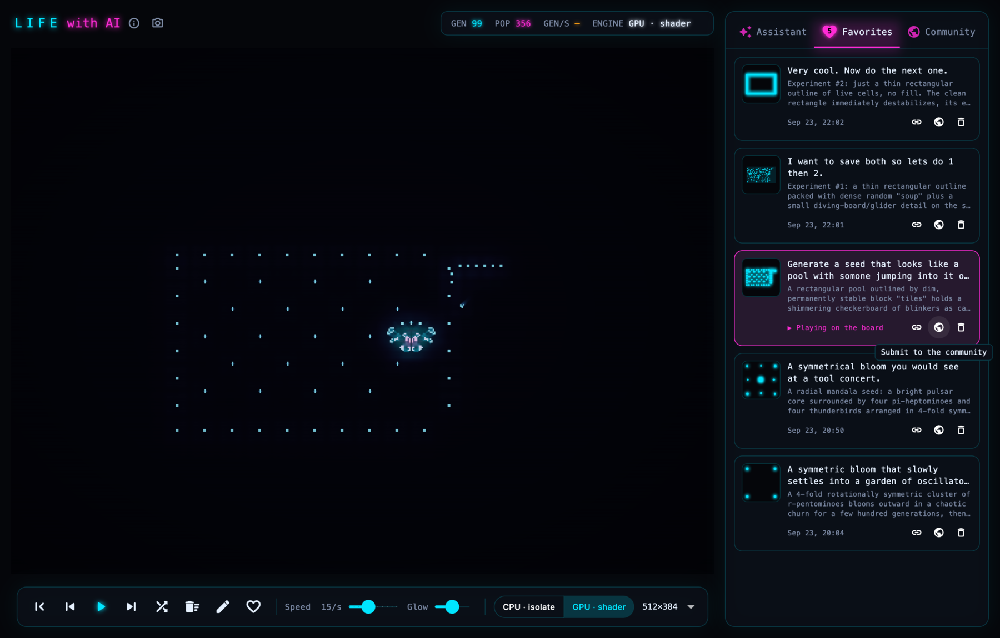 | 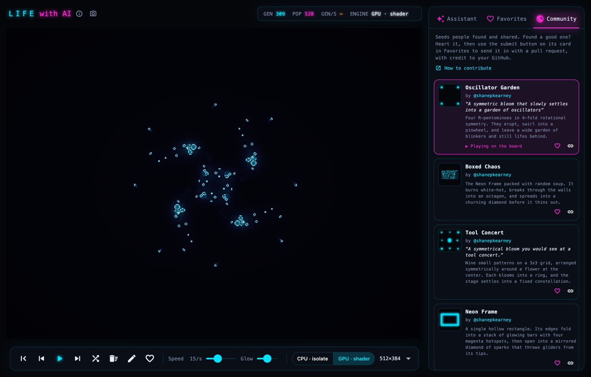 |
| **Hotspots: crowded regions run from cyan through magenta to amber** | **A broken or cut-off link explains itself, and offers the Community tab** |
| 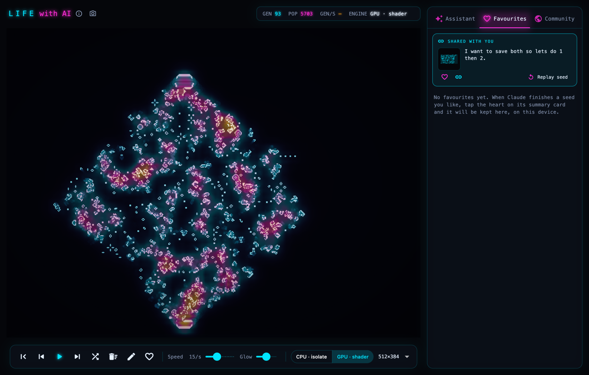 | 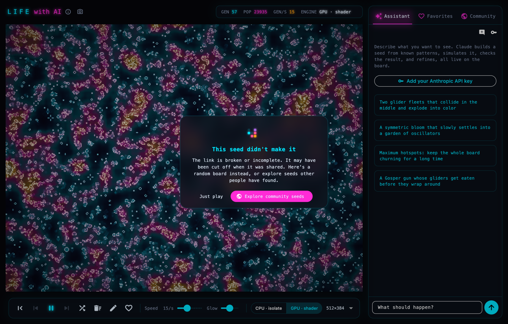 |
| **On a phone: a share link opens on its card, with the sender's note** | **On a phone: the Community tab** |
| 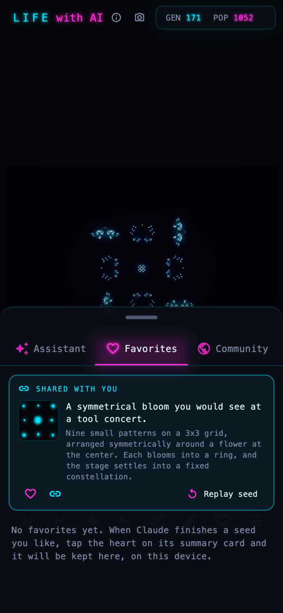 | 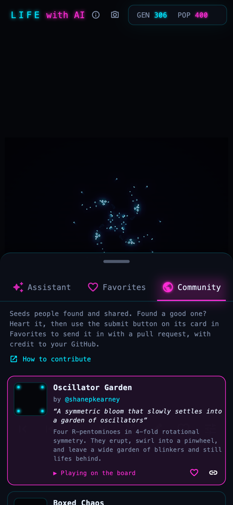 |
| **The about panel** | **The loader: the logo's glider, flying by Conway's rules** |
| 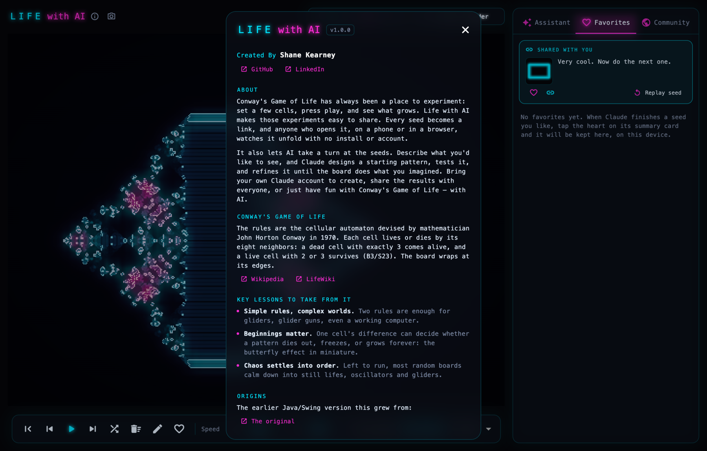 | <p align="center"></p> |

The 📷 button beside the logo saves the whole window as a PNG at 2× or better, ready for a README
or a post (these screenshots were taken the same way). On the web it downloads the file; on macOS it
saves to Downloads. Toasts are left out of the picture, and the board can be cropped out of the full
window afterwards.

## Architecture

```
lib/core      Grid (toroidal, Uint8List) + RLE pattern library. Pure Dart, no Flutter.
lib/engine    LifeEngine interface with two interchangeable implementations:
                CpuEngine  - steps in a background isolate (inline on web), uploads a texture
                GpuEngine  - steps with a fragment shader, ping-ponging GPU-resident images
lib/render    GlowPipeline: trail (persistence) + density (hotspot) passes, then composite
shaders/      life_step, trail, density, composite (GLSL, compiled by Flutter)
lib/ai        Seed agent: Anthropic client (raw HTTP), tool loop, sandbox tools, simulator
lib/app       LifeController (play/pause, speed, engine hot-swap, drawing) + AssistantController
lib/ui        Canvas, HUD, control bar
```

Both engines emit the same thing: one pixel per cell as a `ui.Image`. The renderer therefore
never knows which engine produced a frame, and the engines can be swapped mid-run from the
control bar to compare throughput on the same pattern.

### Why two engines

| | CPU isolate | GPU shader |
|---|---|---|
| Throughput | bounded by Dart loop + texture upload per frame | one draw call per generation, no upload |
| Testability | trivially unit-testable | verified against the CPU by a parity test |
| Readback | free (board lives in Dart) | `toByteData` stalls the GPU, so it is throttled |
| Web | runs on the main thread (no isolates) | same as native |

`test/engine/engine_parity_test.dart` requires the GPU engine to match the CPU rules
bit-for-bit, including odd board sizes and wrap-around at the edges.

### Hotspot glow

`density.frag` computes local population density at quarter resolution (64 bilinear taps
covering 16×16 cells). `composite.frag` maps that density through a violet → cyan → magenta
→ amber → white heat ramp, adds a fading trail buffer, and draws live cells tinted by how
crowded their neighborhood is.

## The seed assistant

You describe an outcome ("two glider fleets collide and explode into color"), and Claude
builds a seed, simulates it, reads the result, and refines it. You can watch it working on the
board.

**It's an agent loop, not one-shot generation.** LLMs are poor at predicting Game of Life
dynamics, but good at planning and at reading feedback. So the model gets tools and checks its
own work:

| Tool | Purpose |
|---|---|
| `place_pattern` | stamp a named pattern (glider, Gosper gun, pulsar, acorn…) with rotation and flip |
| `draw_shape` | lines, rectangles, ellipses, seeded random soup |
| `set_cells` / `clear_board` | fine edits |
| `view_board` | ASCII of the seed, whole board or a 1:1 region |
| `simulate` | run forward without changing the seed; returns its fate (dies / still life / period-N / growing), a population curve, hotspot counts and ASCII thumbnails |
| `simulate(include_image)` | adds a PNG of the final board when the shape matters (≈ w×h/750 tokens, ~260 for 512×384) |
| `finish` | hand the seed to the board and start playing |

Design choices:

- **The pattern library is tested.** Every claim the model relies on (glider heading, gun
  cadence, oscillator periods, diehard's 130 generations) is asserted in `test/core`. Writing
  those tests caught that the standard RLE spaceships travel *left*; they are now mirrored.
- **Simulation runs on the CPU grid, off the UI thread** (`compute`), independent of which
  engine draws the board.
- **Every experiment is replayed for the user.** `simulate` computes instantly, so Claude gets
  its report straight away. Meanwhile the board replays the same run, fast-forwarded to about 8s
  and stopping on the exact generation Claude inspected, while the next API call is in flight.
  The playback therefore adds no waiting. Queued runs play in order, and the final seed takes
  over when they end.
- **Bad tool input returns an `is_error` result**, so the model corrects itself rather than
  the loop crashing.
- **Guardrails for a user-supplied key:** at most 10 model turns per request, a live cost
  meter (cache-aware), and a Stop button. The system prompt and tools are a stable prefix
  with `cache_control`, so each refine turn re-reads them at 0.1× cost.
- **Model:** Claude Opus 5 by default (Sonnet 5 selectable), adaptive thinking with
  summarized reasoning shown in the chat, and server-side refusal fallbacks enabled.
- **Key handling:** the user pastes their own key. It is sent only to `api.anthropic.com`,
  with the direct-browser-access header the web build needs, and is kept in memory unless
  "remember" is ticked (then stored unencrypted in app storage, as the dialog says).

`test/ai/seed_agent_test.dart` drives the whole loop against scripted API responses: tool
results are batched in order, thinking blocks are echoed back unchanged, roles still alternate
on follow-ups, the turn cap holds, and the required headers and cache settings are present.

## Phones and small windows

The layout follows the space the app has, never the device type: below 700px wide (or 500px tall,
e.g. a landscape phone) it switches live to a phone layout; wider windows keep the desktop layout.
The phone layout puts the board on top, a one-row control strip under it (speed, glow, engine, board
size and clear behind ⚙), and the assistant in a bottom sheet. At rest the sheet is just its three
tabs, **Assistant**, **Favorites** and **Community**; tapping one opens the sheet on that view, and Claude's spinner
shows on its tab even while the sheet is closed. Phones start on a portrait 192×256 board, which
fills a tall screen instead of letterboxing a 4:3 one.

## Rewind

⏮ goes back to where the run began and |◀ steps back one generation (← and → step while paused on
desktop). Game of Life can't run backwards, since many boards lead to the same next one, so
`lib/core/timeline.dart` keeps the run's origin plus a bit-packed snapshot every 64 generations, and
rebuilds any earlier generation from the nearest snapshot: at most 63 steps, instant. Past a 16 MB
budget, every other snapshot is dropped, so long runs rewind more slowly rather than using ever more
memory. Anything that puts a new board down (a seed, clear, an experiment, or drawing) starts a new
timeline; switching engines keeps it. Tests step back 70 generations one at a time on both engines
and match the forward run exactly.

## Favorites and share links

Tap the heart on any of Claude's finished seeds to keep it, or the heart in the control bar to save
the board exactly as it is at that moment (titled after its source, e.g. `A restless R-pentomino ·
gen 340`). The heart button in the panel header opens your favorites next to the board: click one to
play it, copy its share link, or delete it (with undo). Favorites stay on your device (localStorage
on the web), with no account or server. Each favorite and the collection as a whole are
size-capped, because a write over the browser's ~5 MB quota fails outright and would silently lose
every later save.

Opening a share link plays the seed and opens the **Favorites** tab with a **Shared with you** card pinned to the top, with
the same replay, heart and copy-link controls as Claude's own seeds. Opening a link never adds it to
favorites by itself. Links carry the sender's prompt as a title, so a saved link keeps its name, and a
note: Claude's summary or the favorite's description. The seed always travels whole. The note only fills
the room left under 2,000 characters (where some chat apps cut links off) and is shortened with an ellipsis
to fit, so a large seed's link has no note.

A share link carries the whole seed in the URL fragment, e.g.
`https://shanepkearney.github.io/life-with-ai/#seed=1_512x384_210_150_bo-2bo-3o&title=One%20glider`.
The app reads the fragment itself and doesn't route on it, so the address stays as sent and a reload
replays the seed (checked in Chrome against the production build).
The fragment is never sent to the server, so long links can't be rejected and shared seeds stay out of
server logs. `lib/core/seed_codec.dart` encodes the live cells' bounding box as URL-safe run-length rows:
Claude's designs come to a few hundred characters (Oscillator Garden's is 64), while a full random board
would be over 100 KB, so only designed seeds are meant for sharing. Decoding treats every link as
untrusted and rejects bad sizes, runs off the board and unknown characters.

## Community seeds

The **Community** tab lists seeds that people found and contributed, each credited `by @username` with a
link to the finder's GitHub profile. Each seed is one file in [`community/seeds/`](community/seeds),
bundled into the app, so a merged pull request goes live with the next Pages deploy. One file per seed
means submissions in flight never conflict with each other.

To submit one, heart it, then press 🌐 on its card in Favorites. That opens GitHub's new-file page with
the entry filled in: the contributor adds their username and proposes the file, and GitHub forks the repo
and opens the pull request for them. A seed too long for GitHub's URL has its entry copied to the
clipboard instead. [CONTRIBUTING.md](CONTRIBUTING.md) covers the format and the manual route.

Every pull request runs `test/community_seeds_test.dart`. It checks that the JSON parses, the file is
named after the seed, and the author is a valid GitHub username. The link must be a share link for this
site, with a non-empty seed on one of the app's board sizes. Lengths must be within limits, and no name
or seed may repeat. Its failure messages are written for the contributor. The app parses entries the
same way at load and skips a bad one rather than failing the tab, and it shows every field as plain text.

## Testing

| Suite | Runs | Covers |
|---|---|---|
| `test/` (unit + widget) | `flutter test`, on Linux in CI | community seed entries, rules and pattern claims, GPU≡CPU parity, seed codec, favorites storage, share-link parsing of hostile input, the agent loop against scripted API replies, experiment and seed replay, the favorites UI flow, frame-rate-independent speed, layout at two window sizes |
| `integration_test/` | `flutter test integration_test -d macos` (one entry point, `all_test.dart`, since each file would relaunch the app), on a macOS runner in CI | the real app end to end, at desktop and phone sizes (iPhone SE, iPhone 15, Pixel 7, landscape): boot and play, rewind, the phone sheet and its tabs, engine hot-swap, opening share links (valid and broken), the Shared-with-you card (replay, save, survives a new chat), saving moments (exact titles, duplicates, undo, empty board), and a full assistant run (experiment replay → finish → replay → heart → recall from favorites → copy link through the real clipboard). Only the Anthropic API is scripted |

`.github/workflows/pages.yml` runs both on every push and pull request. The web build is deployed
to Pages only when both pass on `main`.

## Analytics

The live site counts visits with [Cloudflare Web Analytics](https://www.cloudflare.com/web-analytics/), which
sets no cookies and doesn't track anyone across sites. The Pages build adds its beacon from the `CF_BEACON_TOKEN`
repository variable; local builds and the macOS app have none.

## Versioning and releases

Every deploy is a [semantic version](https://semver.org). When a merge to `main` passes both test suites,
`tool/next_version.dart` reads the commits since the last release tag and picks the next version from their
[Conventional Commits](https://www.conventionalcommits.org) prefixes:

| Commit | Bump | Example |
|---|---|---|
| `feat: …` | minor | 1.2.3 → 1.3.0 |
| `fix: …`, `docs: …`, `chore: …`, anything else | patch | 1.2.3 → 1.2.4 |
| `feat!: …`, or a `BREAKING CHANGE:` footer | major | 1.2.3 → 2.0.0 |

The biggest bump wins, and merge commits don't count (the commits they merge do). The first release is 1.0.0.

The build compiles in the version and its short commit (`--dart-define=APP_VERSION` and `APP_COMMIT`), which the
about panel shows beside the logo as e.g. `v1.3.0 · a1b2c3d`, linked to that release. Once the deploy succeeds, CI
tags the commit `v1.3.0` and creates a GitHub Release, so a failed deploy never uses up a number. A re-run with
nothing new since the last tag deploys again without tagging. Local builds say `dev`.

The release notes come from `tool/release_notes.dart`, not GitHub's generator, which only lists pull requests.
It groups every commit since the last release under Features, Fixes, and Docs and maintenance (breaking changes
first), linking each to its pull request, or to the commit itself when it went straight to `main`. A hand-written
intro in `.github/releases/v<version>.md` goes on top when there is one, as it does for v1.0.0. To preview the
next release's notes: `dart tool/release_notes.dart <version>`.

## Run

```bash
flutter run -d macos
flutter run -d chrome
flutter test
```

The board plays on load. Dev flags: `--dart-define=NO_AUTOPLAY=true` starts paused;
`--dart-define=ENGINE=cpu` starts on the CPU engine.

Speed is a rate in generations per second (1–960, geometric steps), not "generations per frame",
so it runs the same on 60 Hz and 120 Hz displays; `test/app_speed_test.dart` checks both.

Controls: space = play/pause; drag on the board to draw (toggle the pencil to erase).
