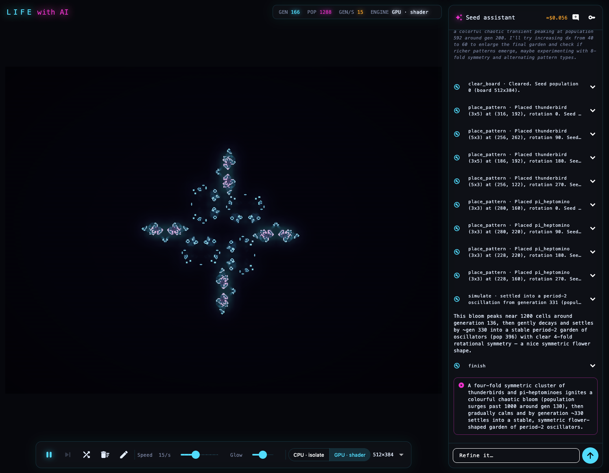
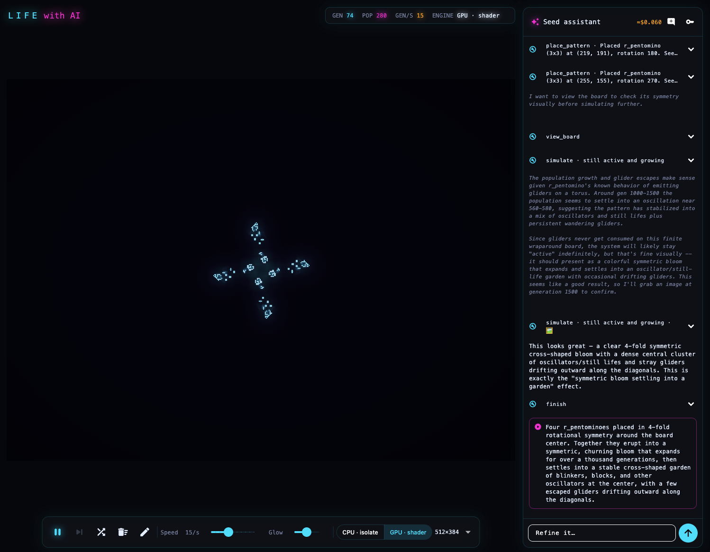
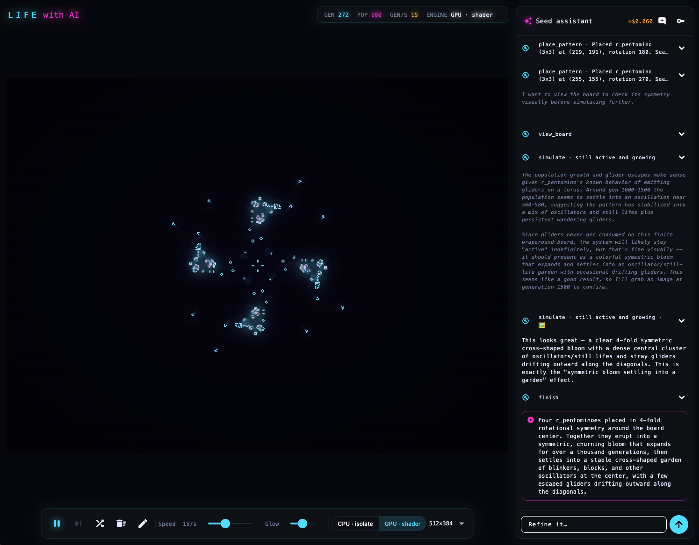
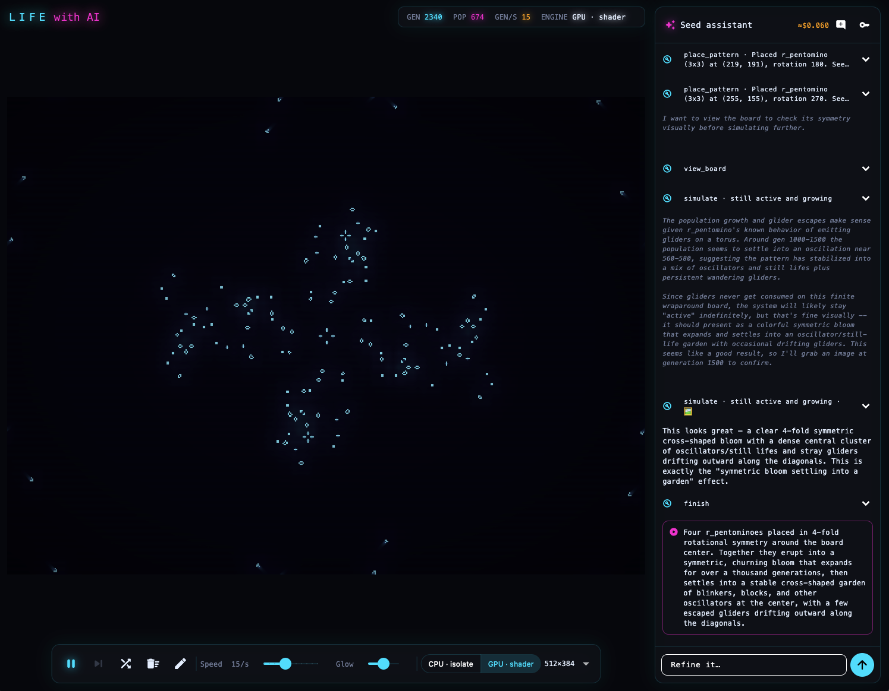
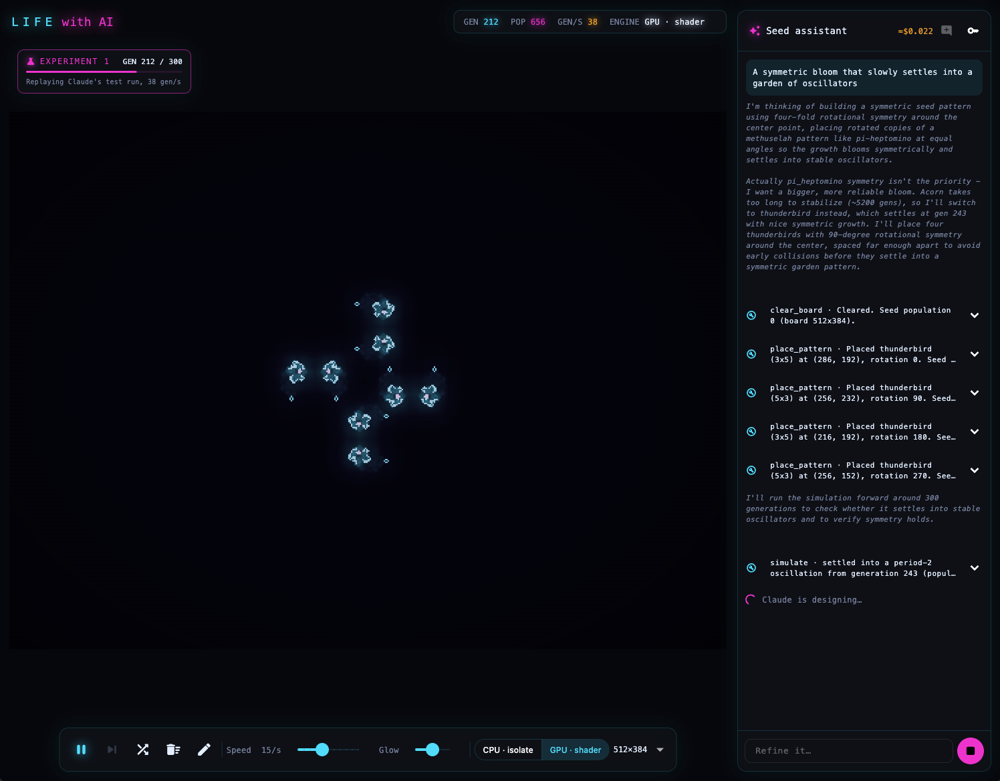
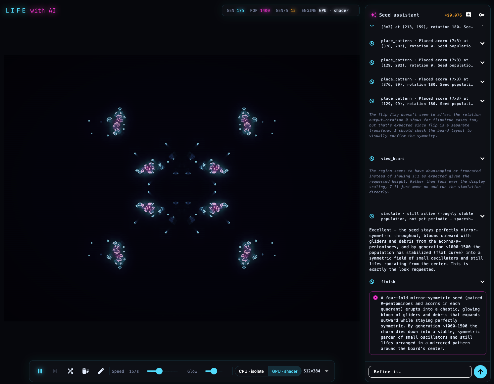
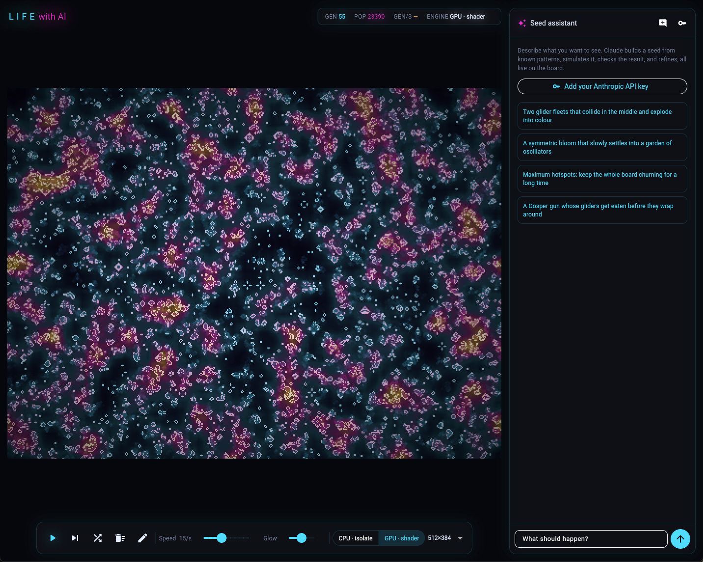
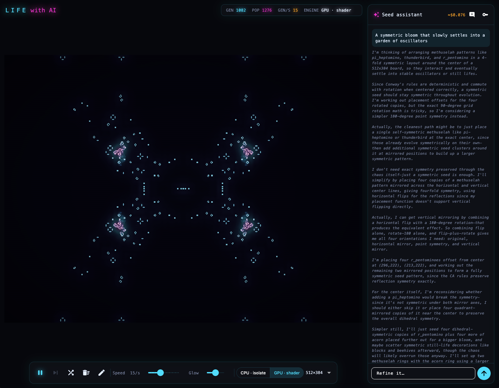

# Life with AI

Conway's Game of Life in Flutter, with a shader-driven neon glow that heats up where cells
congregate, and an AI assistant that designs a starting pattern to produce the outcome you describe.

**Live: https://shanepkearney.github.io/life-with-ai/** (bring your own Anthropic API key for
the assistant; the simulation works without one).



*Asked for "a symmetric bloom that slowly settles into a garden of oscillators", Claude placed
four thunderbirds and four pi-heptominoes in 4-fold rotational symmetry and ran two experiments.
It confirmed the bloom peaks near 1,200 cells around generation 136, then settles by
generation ~330 into a period-2 garden, and handed the seed over. The whole run cost about $0.06.*

A reimagining of [shanepkearney/life](https://github.com/shanepkearney/life), a Java/Swing
implementation. It keeps the original's rules and toroidal (wrap-around) board, and its
1024×768 board is one of the size presets.

## Gallery

**One seed, three moments.** Four R-pentominoes in 4-fold rotational symmetry erupt into a
cross, throw off gliders, and settle into a garden of oscillators.

| Generation 74 | Generation 272 | Generation 2340 |
|---|---|---|
|  |  |  |

| Watching Claude experiment | Another take: mirror symmetry |
|---|---|
|  |  |
| The star above, mid-design: each `simulate` call replays on the board while Claude thinks about its next step. | The same prompt on another run: paired R-pentominoes and acorns in each quadrant, about $0.08. |

| Hotspots on a random soup (web build) | The mirror bloom, 900 generations later |
|---|---|
|  |  |
| The density shader colours crowded regions from cyan through magenta to amber. | Generation 1082: the churn has thinned into a mirrored field of oscillators around four hot cores. |

## Architecture

```
lib/core      Grid (toroidal, Uint8List) + RLE pattern library. Pure Dart, no Flutter.
lib/engine    LifeEngine interface with two interchangeable implementations:
                CpuEngine  - steps in a background isolate (inline on web), uploads a texture
                GpuEngine  - steps with a fragment shader, ping-ponging GPU-resident images
lib/render    GlowPipeline: trail (persistence) + density (hotspot) passes, then composite
shaders/      life_step, trail, density, composite (GLSL, compiled by Flutter)
lib/ai        Seed agent: Anthropic client (raw HTTP), tool loop, sandbox tools, simulator
lib/app       LifeController (play/pause, speed, engine hot-swap, drawing) + AssistantController
lib/ui        Canvas, HUD, control bar
```

Both engines emit the same thing: one pixel per cell as a `ui.Image`. The renderer therefore
never knows which engine produced a frame, and the engines can be swapped mid-run from the
control bar to compare throughput on the same pattern.

### Why two engines

| | CPU isolate | GPU shader |
|---|---|---|
| Throughput | bounded by Dart loop + texture upload per frame | one draw call per generation, no upload |
| Testability | trivially unit-testable | verified against the CPU by a parity test |
| Readback | free (board lives in Dart) | `toByteData` stalls the GPU, so it is throttled |
| Web | runs on the main thread (no isolates) | same as native |

`test/engine/engine_parity_test.dart` requires the GPU engine to match the CPU rules
bit-for-bit, including odd board sizes and wrap-around at the edges.

### Hotspot glow

`density.frag` computes local population density at quarter resolution (64 bilinear taps
covering 16×16 cells). `composite.frag` maps that density through a violet → cyan → magenta
→ amber → white heat ramp, adds a fading trail buffer, and draws live cells tinted by how
crowded their neighbourhood is.

## The seed assistant

You describe an outcome ("two glider fleets collide and explode into colour"), and Claude
builds a seed, simulates it, reads the result, and refines it. You can watch it working on the
board.

**It's an agent loop, not one-shot generation.** LLMs are poor at predicting Game of Life
dynamics, but good at planning and at reading feedback. So the model gets tools and checks its
own work:

| Tool | Purpose |
|---|---|
| `place_pattern` | stamp a named pattern (glider, Gosper gun, pulsar, acorn…) with rotation and flip |
| `draw_shape` | lines, rectangles, ellipses, seeded random soup |
| `set_cells` / `clear_board` | fine edits |
| `view_board` | ASCII of the seed, whole board or a 1:1 region |
| `simulate` | run forward without changing the seed; returns its fate (dies / still life / period-N / growing), a population curve, hotspot counts and ASCII thumbnails |
| `simulate(include_image)` | adds a PNG of the final board when the shape matters (≈ w×h/750 tokens, ~260 for 512×384) |
| `finish` | hand the seed to the board and start playing |

Design choices:

- **The pattern library is tested.** Every claim the model relies on (glider heading, gun
  cadence, oscillator periods, diehard's 130 generations) is asserted in `test/core`. Writing
  those tests caught that the standard RLE spaceships travel *left*; they are now mirrored.
- **Simulation runs on the CPU grid, off the UI thread** (`compute`), independent of which
  engine draws the board.
- **Every experiment is replayed for the user.** `simulate` computes instantly, so Claude gets
  its report straight away. Meanwhile the board replays the same run, fast-forwarded to about 8s
  and stopping on the exact generation Claude inspected, while the next API call is in flight.
  The playback therefore adds no waiting. Queued runs play in order, and the final seed takes
  over when they end.
- **Bad tool input returns an `is_error` result**, so the model corrects itself rather than
  the loop crashing.
- **Guardrails for a user-supplied key:** at most 10 model turns per request, a live cost
  meter (cache-aware), and a Stop button. The system prompt and tools are a stable prefix
  with `cache_control`, so each refine turn re-reads them at 0.1× cost.
- **Model:** Claude Opus 5 by default (Sonnet 5 selectable), adaptive thinking with
  summarised reasoning shown in the chat, and server-side refusal fallbacks enabled.
- **Key handling:** the user pastes their own key. It is sent only to `api.anthropic.com`,
  with the direct-browser-access header the web build needs, and is kept in memory unless
  "remember" is ticked (then stored unencrypted in app storage, as the dialog says).

`test/ai/seed_agent_test.dart` drives the whole loop against scripted API responses: tool
results are batched in order, thinking blocks are echoed back unchanged, roles still alternate
on follow-ups, the turn cap holds, and the required headers and cache settings are present.

## Phones and small windows

The layout follows the space the app has, never the device type: below 700px wide (or 500px tall,
e.g. a landscape phone) it switches live to a phone layout; wider windows keep the desktop layout.
The phone layout puts the board on top, a one-row control strip under it (speed, glow, engine, board
size and clear behind ⚙), and the assistant in a bottom sheet. At rest the sheet is just two tabs,
**Seed assistant** and **Favourites**; tapping one opens the sheet on that view, and Claude's spinner
shows on its tab even while the sheet is closed. Phones start on a portrait 192×256 board, which
fills a tall screen instead of letterboxing a 4:3 one.

## Rewind

⏮ goes back to where the run began and |◀ steps back one generation (← and → step while paused on
desktop). Game of Life can't run backwards, since many boards lead to the same next one, so
`lib/core/timeline.dart` keeps the run's origin plus a bit-packed snapshot every 64 generations, and
rebuilds any earlier generation from the nearest snapshot: at most 63 steps, instant. Past a 16 MB
budget, every other snapshot is dropped, so long runs rewind more slowly rather than using ever more
memory. Anything that puts a new board down (a seed, clear, an experiment, or drawing) starts a new
timeline; switching engines keeps it. Tests step back 70 generations one at a time on both engines
and match the forward run exactly.

## Favourites and share links

Tap the heart on any of Claude's finished seeds to keep it, or the heart in the control bar to save
the board exactly as it is at that moment (titled after its source, e.g. `A restless R-pentomino ·
gen 340`). The heart button in the panel header opens your favourites next to the board: click one to
play it, copy its share link, or delete it (with undo). Favourites stay on your device (localStorage
on the web), with no account or server. Each favourite and the collection as a whole are
size-capped, because a write over the browser's ~5 MB quota fails outright and would silently lose
every later save.

Opening a share link plays the seed and pins a **Shared with you** card to the top of the chat, with
the same replay, heart and copy-link controls as Claude's own seeds. Opening a link never adds it to
favourites by itself. Links carry the sender's prompt as a title, so a saved link keeps its name.

A share link carries the whole seed in the URL fragment, e.g.
`https://shanepkearney.github.io/life-with-ai/#seed=1_512x384_210_150_bo-2bo-3o&title=One%20glider`.
The app reads the fragment itself and doesn't route on it, so the address stays as sent and a reload
replays the seed (checked in Chrome against the production build).
The fragment is never sent to the server, so long links can't be rejected and shared seeds stay out of
server logs. `lib/core/seed_codec.dart` encodes the live cells' bounding box as URL-safe run-length rows:
Claude's designs come to a few hundred characters (the hero star is 163), while a full random board
would be over 100 KB, so only designed seeds are meant for sharing. Decoding treats every link as
untrusted and rejects bad sizes, runs off the board and unknown characters.

## Testing

| Suite | Runs | Covers |
|---|---|---|
| `test/` (unit + widget) | `flutter test`, on Linux in CI | rules and pattern claims, GPU≡CPU parity, seed codec, favourites storage, share-link parsing of hostile input, the agent loop against scripted API replies, experiment and seed replay, the favourites UI flow, frame-rate-independent speed, layout at two window sizes |
| `integration_test/` | `flutter test integration_test -d macos` (one entry point, `all_test.dart`, since each file would relaunch the app), on a macOS runner in CI | the real app end to end, at desktop and phone sizes (iPhone SE, iPhone 15, Pixel 7, landscape): boot and play, rewind, the phone sheet and its tabs, engine hot-swap, opening share links (valid and broken), the Shared-with-you card (replay, save, survives a new chat), saving moments (exact titles, duplicates, undo, empty board), and a full assistant run (experiment replay → finish → replay → heart → recall from favourites → copy link through the real clipboard). Only the Anthropic API is scripted |

`.github/workflows/pages.yml` runs both on every push and pull request. The web build is deployed
to Pages only when both pass on `main`.

## Run

```bash
flutter run -d macos
flutter run -d chrome
flutter test
```

The board plays on load. Dev flags: `--dart-define=NO_AUTOPLAY=true` starts paused;
`--dart-define=ENGINE=cpu` starts on the CPU engine.

Speed is a rate in generations per second (1–960, geometric steps), not "generations per frame",
so it runs the same on 60 Hz and 120 Hz displays; `test/app_speed_test.dart` checks both.

Controls: space = play/pause; drag on the board to draw (toggle the pencil to erase).
